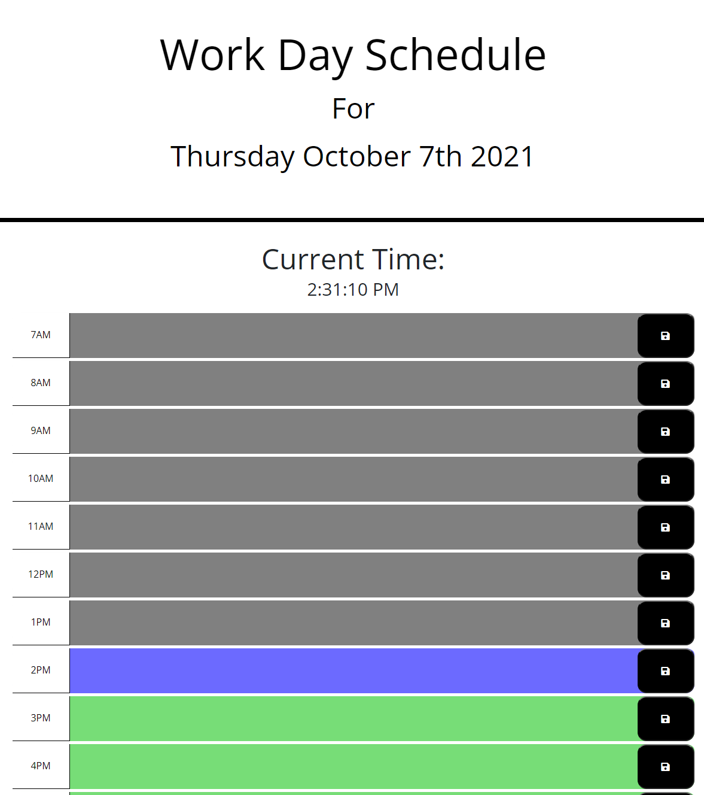

Work Day Scheduler

Live Link: https://jiohc.github.io/Workday-Scheduler/

Work day scheduler that allows user to add an event to different time blocks for the current day. 

Time blocks display different color based on past, present, future times. 

Data is saved to local storage after clicking on the save icon to the right.

